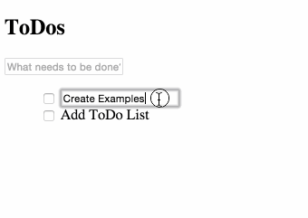

# Steps for Pre-work

1. Setup Project
2. Backbone Primer
3. Build TODO app
4. Submit TODO app for review via Github
5. Extend your TODO app, improve UI, add features

# Setup Project

Create the HTML, CSS & JavaScript template by downloading this [boilerplate project](boilerplate-download).

# Backbone Primer

You'll need an understanding of JavaScript, here are some references you can use to help with the fundamentals:

- [JavaScript Garden](http://bonsaiden.github.io/JavaScript-Garden/)
- [JSFundamentals](https://leanpub.com/jsfun/read#leanpub-auto-javascript-fundamentals-the-powerful-and-misunderstood-language-of-the-web)
- [Mozilla Developer Network](https://developer.mozilla.org/en-US/docs/Web/JavaScript/Guide)
 
Additionally a basic understanding of HTML5 & CSS will be helpful. For that refer to the [Mozilla Developer Network][https://developer.mozilla.org/en-US/docs/Web] for the Basics.

## Models

The `Model` contains the interactive data and the logic surrounding it, such as data validation, getters and setters, default values, etc. Check out the [Model][models] documentation for more.

Create your ToDo Model and start the namespace of your app:

```JavaScript
// 1. Create the namespace for our app
var app = {}; // create namespace for our app

// 2. Add the model
app.Todo = Backbone.Model.extend({
    defaults: {
        title: '',
        completed: false
    }
});
```

## Views

```JavaScript
// 4. Render individual todo items list (li)
app.TodoView = Backbone.View.extend({
    tagName: 'li',
    template: _.template($('#item-template').html()),
    render: function(){
        this.$el.html(this.template(this.model.toJSON()));
        return this; // enable chained calls
    }
});
```

## Collections

Collections are ordered sets of models, for more details check out the [Backbone docs][collections].

We are going to use HTML5’s local storage for persistence through a Backbone plugin. Lets define the localStorage property. This library was already included in the boilerplate, called `backbone-localstorage.js`:

```HTML
<script src="http://cdnjs.cloudflare.com/ajax/libs/backbone-localstorage.js/1.0/backbone.localStorage-min.js" type="text/javascript">
```

Then create your first collection and instantiate it on the app:

```JavaScript
// 3. Define & Instantiate the colleciton
app.TodoList = Backbone.Collection.extend({
  model: app.Todo,
  localStorage: new Store("backbone-todo")
});

// instance of the Collection
app.todoList = new app.TodoList();
```

## Events

[Events][events] are written in the following format:
```JavaScript
{"<EVENT_TYPE> <ELEMENT_ID>": "<CALLBACK_FUNTION>"}
```

For Example:
```JavaScript
events: {'keypress #new-todo': 'createTodoOnEnter'}
```

We'll be adding these later to our project.

# Build TODO App

## Basic TODO View

In the section **Your HTML** of `backbone-todo.html` add the following to outline our ToDo View:

```HTML
<section id="todoapp">
    <header id="header">
      <h1>ToDos</h1>
      <input id="new-todo" placeholder="What needs to be done?">
    </header>
    <section id="main">
      <ul id="todo-list"></ul>
    </section>
</section>
```

We'll also need to create a template for all ToDo items, lets call it  `item-template`:

```HTML
<script type="text/template" id="item-template">
    <div class="view">
        <input class="toggle" type="checkbox">
        <label><%- title %></label>
    </div>
</script>
```

Then add the template to a rendering object in `js/app.js`:

```JavaScript
// 4. Render individual todo items list (li)
app.TodoView = Backbone.View.extend({
    tagName: 'li',
    template: _.template($('#item-template').html()),
    render: function(){
        this.$el.html(this.template(this.model.toJSON()));
        return this; // enable chained calls
    }
});
```

Doesn't look like much, but your app should look similar to below:


## Create TODO Item & Populate the View

Now lets include some functionality to our app by creating a ToDo item. Hop into `js/app.js` and add the following while following along with the comments:

```JavaScript
// 5. Create ToDo Items & Populate the View
// renders the full list of todo items calling TodoView for each one.
app.AppView = Backbone.View.extend({
        el: '#todoapp',                 // the element in HTML we're binding to the app view
        initialize: function () {
        this.input = this.$('#new-todo');
        // when new elements are added to the collection render then with addOne
        app.todoList.on('add', this.addOne, this);
        app.todoList.on('reset', this.addAll, this);
        app.todoList.fetch();           // loads list from local storage
    },
    events: {                           // adding the event from before to our app
    'keypress #new-todo': 'createTodoOnEnter'
    },
    createTodoOnEnter: function(e){
        if ( e.which !== 13 || !this.input.val().trim() ) { // ENTER_KEY = 13
            return;
        }
        app.todoList.create(this.newAttributes());
        this.input.val('');             // clean input box
    },
    addOne: function(todo){
        var view = new app.TodoView({model: todo});
        $('#todo-list').append(view.render().el);
    },
    addAll: function(){
        this.$('#todo-list').html('');  // clean the todo list
        app.todoList.each(this.addOne, this);
    },
    newAttributes: function(){          // creates a new instance of the model w/ values
        return {
            title: this.input.val().trim(),
            completed: false
        }
    }
});

//--------------
// Initializers
//--------------   

app.appView = new app.AppView();        // intializing the app view
```

At this point, your app should look something like below:


## Add 'Edit' Functionality

1. Add the following to your `item-template` next to the *title* `label` in `backbone-todo.html` to make the items dynamic:

```HTML
<input class="edit" value="<%- title %>">
```

2. Use CSS to manipulate visability of the elements:

```CSS
#todo-list input.edit {
    display: none; /* Hides input box*/
}
#todo-list .editing label {
    display: none; /* Hides label text when .editing*/
}
#todo-list .editing input.edit {
    display: inline; /* Shows input text box when .editing*/
}
```

3. Adding the ToDo item view modifications and events:

```JavaScript
// renders individual 'todo items' as list (li) elements
app.TodoView = Backbone.View.extend({
    tagName: 'li',
    template: _.template($('#item-template').html()),
    render: function(){
        this.$el.html(this.template(this.model.toJSON()));
        // 6. Add input to list object
        this.input = this.$('.edit');   // grab input from item flagged as 'edit'
        return this;                    // enable chained calls
    },
    // 7. Register the 'on change' event
    initialize: function(){
        this.model.on('change', this.render, this);
    },
    // 8. Add 'editing' event listeners
    events: {
        'keypress .edit' : 'updateOnEnter',
        'dblclick label' : 'edit',      // edit a ToDo item event
        'blur .edit' : 'close'          // blurs when finished editing a ToDo item
    },
    // 9. Add functions for editing behaviors
    edit: function(){
        this.$el.addClass('editing');
        this.input.focus();
    },
    close: function(){
        var value = this.input.val().trim();
        if(value) {
            this.model.save({title: value});
        }
        this.$el.removeClass('editing');
    },
    updateOnEnter: function(e){
        if(e.which === 13){
            this.close();
        }
    }
});
```

Your app should look something like this:



That doesn't seem right... lets fix that.

**Fix up the checkboxes**

1. Modify the checkbox of our `item-template` in `backbone-todo.html` to make the toggles dynamic:

```HTML
<input class="toggle" type="checkbox" <%= completed ? 'checked' : '' %>>
```

2. Update the Model with a function to *save* the **toggle** state:

```JavaScript
app.Todo = Backbone.Model.extend({
    defaults: {
        title: '',
        completed: false
    },
    toggle: function(){  // toggle function
        this.save({ completed: !this.get('completed')});
    }
});
```

3. Then add events to the event list:

```JavaScript
    events: {
        'dblclick label' : 'edit',
        'keypress .edit' : 'updateOnEnter',
        'blur .edit' : 'close',
        'click .toggle': 'toggleCompleted'      // respond to toggle event
    },
```

At the end of the ToDo item, add the following function:

```JavaScript
    toggleCompleted: function(){
        this.model.toggle();
    }
});     // end of the 'view' declaration
```


## Add 'Delete' Functionality

1. Add a remove button in `backbone-todo.html` in the `item-template` at the end of the `div`:

```HTML
<button class="destroy">remove</button>
```

2. Initialize and add the event listeners to the ToDo item `view`:

```JavaScript
initialize: function(){
    this.model.on('change', this.render, this);
    this.model.on('destroy', this.remove, this); // remove: Convenience Backbone's function for removing the view from the DOM.
},
events: {
    'dblclick label' : 'edit',
    'keypress .edit' : 'updateOnEnter',
    'blur .edit' : 'close',
    'click .toggle': 'toggleCompleted',
    'click .destroy': 'destroy'         // register on click to destroy
},
```

3. Add the `destroy` method to the list of methods:

```JavaScript
destroy: function() {
    this.model.destroy();
}
```

Your app should look something like this:


# Submitting App to Github

Once you have completed the ToDo application **including support for editing an item**, please [push your app via Github](https://help.github.com/articles/create-a-repo). All submissions occur via Github and we require each submission to follow a particular format which includes a **clearly documented README** with a GIF walkthrough and **an issue raised** as detailed below.


Submit your project by **creating an issue on your repository** and adding our Github handles to the issue body (**@codepathreview** and **@codepath**) so we can review the submission. See the [example of the issue](https://github.com/codepath/backbone-todo-demo/issues/2).

Also be sure to **include a README** containing a GIF walkthrough using [LiceCap](http://www.cockos.com/licecap/) of the app demonstrating how it works with required user stories completed. See [this README](https://github.com/codepath/android-rottentomatoes-demo/blob/submission/README.md) as an example of a complete README. Use [this README template](http://courses.codepath.com/snippets/intro_to_android/readme_templates/prework_readme.md?raw=true) for your completed ToDo app.

**Note:** All project submissions happen via github. If needed, review how to push your apps to github with [this handy tutorial](https://help.github.com/articles/create-a-repo). You should add a [.gitignore](https://gist.githubusercontent.com/nesquena/5617544/raw/.gitignore) to your project as well to **avoid storing compiled and local files in git**.

**Windows Users:** For LiceCap to record GIFs properly in certain versions of Windows, be sure to set Scaling to 100%.

### Submission Checklist

Please **review the following checklist** to ensure your submission is valid:

 * Can you **successfully add and remove items** from the todo list within your app?
 * Did you include support for **editing todo items** as described above?
 * Does your app **persist todo items** and retrieve them on page refresh?
 * Did you successfully **push your code to github**? Can you see the code on github?
 * Did you **add a README** which includes a **GIF walkthrough** of the app's functionality?
 * Did you **create an issue** on the repo and include **/cc @codepathreview @codepath** in the issue body?

If the answer to all of these is **YES** then you've successfully completed the basic todo app. When you've completed this, we will schedule a short phone call with you so we can chat further and answer any questions you have about the bootcamp and the rest of the selection process. In the meantime, you should focus on **improving the functionality and user interface** of your Todo app as explained below.

**Questions?** If you have any questions or concerns, please feel free to email us at <nodejs@codepath.com>.

# Extend TODO App

Here are some suggestions you can use to improve and further extend your TODO app:

* Improving the styling w/ CSS
* Add routes to filter by pending or completed tasks

[boilerplate-download]: boilerplate.zip
[models]: http://backbonejs.org/#Model-View-separation
[views]: http://backbonejs.org/#View-rendering
[collections]: http://backbonejs.org/#Model-Collections
[events]: http://backbonejs.org/#Events